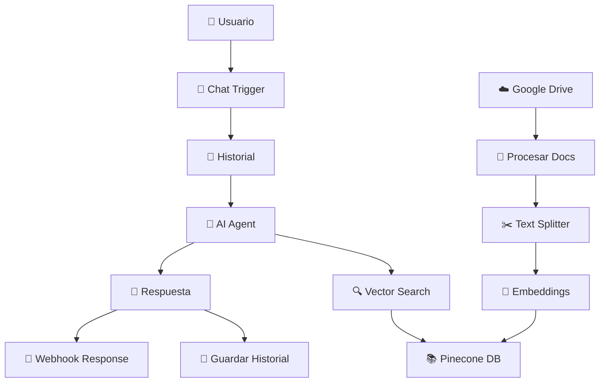
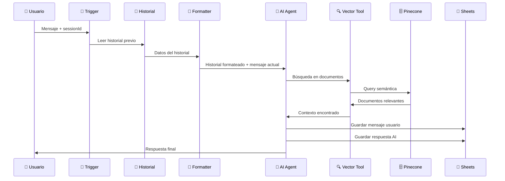
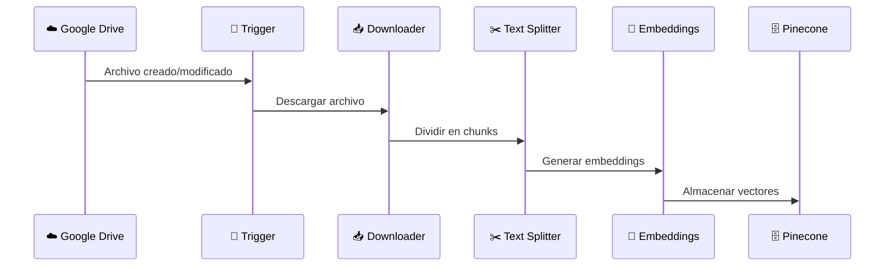

# 🐾 DiagnoVet Plus - Chatbot Veterinario Inteligente

## 📋 Descripción General

**DiagnoVet Plus** es un asistente veterinario inteligente construido con n8n que utiliza tecnología RAG (Retrieval-Augmented Generation) para proporcionar análisis clínicos, diagnósticos y recomendaciones basadas en documentación veterinaria especializada.

## 🏗️ Arquitectura del Sistema



## 🔧 Componentes Principales

### 1. 🎯 **Chat Trigger** - Punto de Entrada
- **Función**: Recibe mensajes del usuario vía webhook
- **Configuración**: Webhook público con CORS habilitado
- **Input**: `chatInput` y `sessionId`

### 2. 📚 **Sistema de Documentación**
#### Ingesta de Documentos:
- **Google Drive Triggers**: Monitora carpeta específica cada 5 minutos
- **Eventos**: Archivos creados y actualizados
- **Procesamiento**: Descarga → División → Embeddings → Almacenamiento

#### Pipeline de Procesamiento:
```
📁 Google Drive → 📥 Download → ✂️ Text Splitter → 🧠 Embeddings → 🗄️ Pinecone
```

### 3. 🤖 **AI Agent** - Cerebro del Sistema
#### Modelo: Google Gemini 2.0 Flash
- **Temperatura**: 0.1 (respuestas precisas)
- **Max Tokens**: 2048
- **Especialidad**: Dr. VetAI - Asistente veterinario especializado

#### Capacidades:
- 🔬 Análisis clínico
- 🎯 Diagnóstico asistido
- 💊 Recomendaciones terapéuticas
- 📚 Educación y consulta
- 🩺 Múltiples especialidades veterinarias

### 4. 🔍 **Vector Store Tool**
- **Base de datos**: Pinecone
- **Embeddings**: Google text-embedding-004
- **Función**: Búsqueda semántica en documentación

### 5. 💾 **Sistema de Historial**
- **Almacenamiento**: Google Sheets
- **Tracking**: Conversaciones por sessionId
- **Persistencia**: Mensajes de usuario y respuestas del AI

## 🚀 Flujo de Trabajo Detallado

### Flujo Principal - Conversación



### Flujo Secundario - Actualización de Documentos



## ⚙️ Configuración Técnica

### Parámetros del Text Splitter
- **Chunk Overlap**: 200 caracteres
- **Método**: Recursive Character Text Splitter

### Configuración del AI Agent
```yaml
Temperatura: 0.1
Max Tokens: 2048
Modelo: gemini-2.0-flash-exp
Sistema: Dr. VetAI especializado
```

### Embeddings
```yaml
Modelo: text-embedding-004
Proveedor: Google Gemini
Dimensiones: Optimizadas para búsqueda semántica
```

## 📊 Estructura de Datos

### Historial de Chat (Google Sheets)
| Campo | Tipo | Descripción |
|-------|------|-------------|
| `timestamp` | String | Momento de la interacción |
| `sessionId` | String | Identificador de sesión |
| `role` | String | 'user' o 'assistant' |
| `message` | String | Contenido del mensaje |

### Vector Store (Pinecone)
- **Index**: `diagnovet-plus-archivos`
- **Dimensiones**: Según text-embedding-004
- **Metadata**: Información del documento fuente

## 🔍 Funcionalidades Principales

### 💬 **Consultas Soportadas**
- ✅ Análisis de casos clínicos
- ✅ Interpretación de imágenes médicas
- ✅ Evaluación de resultados de laboratorio
- ✅ Diagnósticos diferenciales
- ✅ Recomendaciones de tratamiento
- ✅ Consultas generales (libros, películas, etc.)

### 🏥 **Especialidades Veterinarias**
- 🫀 Cardiología
- 🧠 Neurología
- 🔬 Medicina Interna
- ✂️ Cirugía
- 🧬 Oncología
- 🚨 Medicina de Emergencia
- 🛡️ Medicina Preventiva
- 🔍 Diagnóstico por Imagen
- 🧪 Patología Clínica

## 🛡️ Consideraciones Éticas

### ⚠️ **Limitaciones Importantes**
- No reemplaza el juicio clínico veterinario
- Recomendaciones basadas en documentación
- Requiere evaluación presencial para casos urgentes
- Respeta protocolos establecidos

### 🔒 **Seguridad**
- Validación de entrada de datos
- Control de sesiones
- Limitación de historial (últimas 10 interacciones)
- Manejo de errores robusto

## 📈 **Optimizaciones Implementadas**

### Performance
- **Caché**: Resultados de búsqueda vectorial
- **Límites**: Historial truncado automáticamente
- **Temperatura baja**: Respuestas más consistentes

### Experiencia de Usuario
- **Respuestas estructuradas**: Formato claro y profesional
- **Contexto persistente**: Mantiene conversaciones por sesión
- **Búsqueda inteligente**: Encuentra información relevante automáticamente

## 🚀 **Cómo Usar el Sistema**

### Para Desarrolladores

1. **Configurar Credenciales**:
   - Google Drive OAuth2
   - Google Sheets OAuth2  
   - Pinecone API Key
   - Google Gemini API Key

2. **Configurar Webhooks**:
   ```bash
   POST https://tu-instancia-n8n.com/webhook/chatbot-diagnovet
   ```

3. **Payload de Ejemplo**:
   ```json
   {
     "chatInput": "Analiza esta radiografía torácica",
     "sessionId": "session-123",
     "action": "message"
   }
   ```

### Para Veterinarios

1. **Subir Documentos**: 
   - Agregar archivos a la carpeta de Google Drive monitoreada
   - El sistema procesará automáticamente en 5 minutos

2. **Hacer Consultas**:
   - Describir casos clínicos detalladamente
   - Adjuntar imágenes cuando sea posible
   - Proporcionar contexto del paciente

3. **Interpretar Respuestas**:
   - Revisar fuentes consultadas
   - Considerar recomendaciones como apoyo
   - Siempre aplicar criterio clínico profesional

## 🔧 **Monitoreo y Mantenimiento**

### Logs Importantes
- ✅ Procesamiento de documentos
- ✅ Consultas a vector store
- ✅ Respuestas del AI Agent
- ✅ Errores de conexión

### Métricas Clave
- 📊 Tiempo de respuesta promedio
- 📈 Documentos procesados
- 💬 Consultas por sesión
- 🎯 Precisión de búsquedas

## 🆘 **Troubleshooting**

### Problemas Comunes

| Problema | Causa Probable | Solución |
|----------|----------------|----------|
| No encuentra documentos | Embeddings no generados | Revisar pipeline de ingesta |
| Respuestas genéricas | Vector store vacío | Verificar Pinecone index |
| Error de historial | Permisos Google Sheets | Validar credenciales OAuth2 |
| Timeout en respuestas | Modelo sobrecargado | Reducir complejidad de consulta |

---

## 🤝 **Contribuir**

Este README es una guía viva. Para mejoras:
1. Fork del proyecto
2. Documentar cambios
3. Crear pull request
4. Revisión por el equipo

## 📞 **Soporte**

Para soporte técnico, contactar a gabibenitezzz003@gmail.com
- Logs del error
- Payload de la consulta
- SessionId afectado
- Timestamp del incidente

---

*🐾 DiagnoVet Plus - Haciendo la medicina veterinaria más interactiva.*